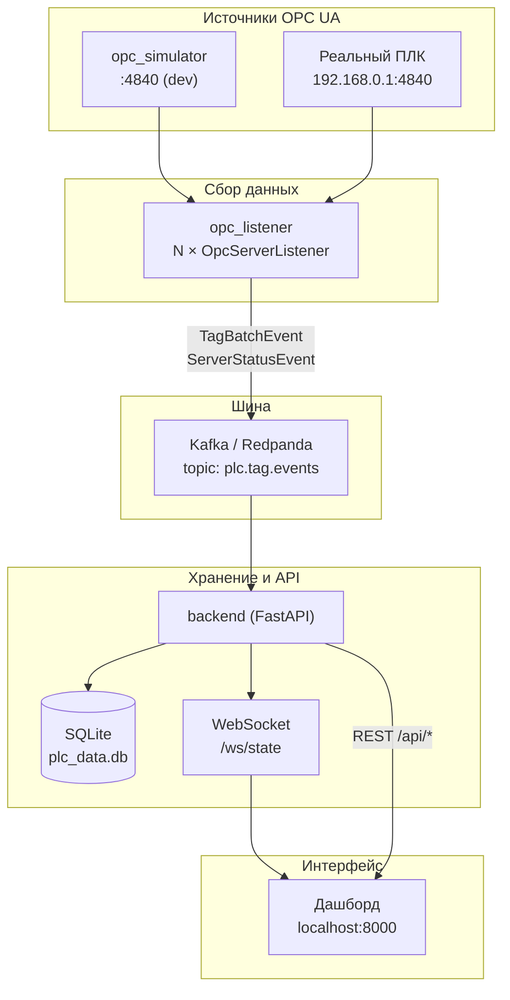

# Архитектура проекта «08.07 (ПЛК)»

## Два независимых слоя

В репозитории **два способа** работать с ПЛК. Они не связаны напрямую, но используют общие данные (NodeSet XML, IP ПЛК).

```
┌─────────────────────────────────────────────────────────────────────────┐
│  СЛОЙ 1 — CLI-инструменты (отладка, ручной запуск)                      │
│                                                                         │
│  plc_reader.py      → snap7 (S7, порт 102)                              │
│  plc_web_reader.py  → HTTP/cookies (Siemens Portal)                     │
│  plc_opc_reader.py  → OPC UA напрямую                                   │
│                                                                         │
│  Конфиги: config.yaml, config_web.yaml, config_opc.yaml                 │
│  БД:      plc_db.py (старая схема, source вместо server_id)             │
└─────────────────────────────────────────────────────────────────────────┘

┌─────────────────────────────────────────────────────────────────────────┐
│  СЛОЙ 2 — Микросервисный pipeline (дашборд, Docker)                    │
│                                                                         │
│  opc_simulator → opc_listener → Kafka → backend → Web UI                │
│                                                                         │
│  Конфиг:  config/servers.yaml                                          │
│  БД:      shared/db.py (новая схема: server_id, tag_latest, status)    │
│  Общее:   shared/ (models, opc_xml)                                    │
└─────────────────────────────────────────────────────────────────────────┘
```

**Правило:** для дашборда и Docker используй **Слой 2**. CLI-скрипты — для быстрой проверки связи с ПЛК без Kafka.

---

## Слой 2 — поток данных (основной)



### Шаг за шагом

| # | Компонент | Что делает | Вход | Выход |
|---|-----------|------------|------|-------|
| 1 | **opc_simulator** | Имитирует ПЛК для разработки без железа | NodeSet XML | OPC UA :4840 |
| 2 | **opc_listener** | Опрашивает OPC-серверы, публикует в Kafka | OPC UA + `servers.yaml` | JSON в Kafka |
| 3 | **Kafka** | Буфер между сбором и обработкой | события от listener | события для backend |
| 4 | **backend** | Пишет в БД, отдаёт REST и WebSocket | Kafka | SQLite + HTTP/WS |
| 5 | **Дашборд** | Показывает live-значения в браузере | WebSocket + REST | UI |

---

## Структура каталогов

```
08.07 (ПЛК)/
│
├── shared/                    ← общая библиотека (Слой 2)
│   ├── models.py              ← Pydantic-события: TagBatchEvent, ServerStatusEvent
│   ├── db.py                  ← SQLite: readings, tag_latest, server_status
│   └── opc_xml.py             ← парсер NodeSet XML → список тегов
│
├── config/
│   └── servers.yaml           ← единый конфиг: Kafka, серверы OPC, интервал опроса
│
├── opc_simulator/             ← [процесс] фейковый ПЛК
│   ├── main.py                ← точка входа
│   └── server.py              ← asyncua Server + генерация значений
│
├── opc_listener/              ← [процесс] сборщик данных
│   ├── main.py                ← запуск N listeners из servers.yaml
│   ├── listener.py            ← OpcServerListener (1 сервер = 1 задача)
│   └── publisher.py           ← Kafka producer
│
├── backend/                   ← [процесс] API + UI
│   ├── app/
│   │   ├── main.py            ← FastAPI, lifespan, WebSocket
│   │   ├── kafka_consumer.py  ← читает Kafka → DB + WS broadcast
│   │   ├── ws_manager.py      ← рассылка подписчикам
│   │   └── api.py             ← REST: /api/servers, /tags/latest, /history
│   └── static/
│       ├── index.html         ← дашборд
│       ├── app.js             ← WebSocket-клиент, фильтры
│       └── style.css
│
├── docker-compose.yml         ← оркестрация всех процессов Слоя 2
├── Dockerfile.simulator
├── Dockerfile.listener
├── Dockerfile.backend
├── requirements-backend.txt   ← зависимости Слоя 2
│
├── ── Слой 1 (CLI, не в Docker) ──
├── plc_opc_reader.py          ← OPC UA клиент напрямую
├── plc_reader.py              ← S7 snap7
├── plc_web_reader.py          ← Siemens Web Portal
├── plc_db.py                  ← старая SQLite-обёртка
├── config_opc.yaml            ← конфиг для plc_opc_reader.py
├── config.yaml                ← конфиг для plc_reader.py
└── Выставка демо.PLC_2.OPCUA.xml  ← описание 169 тегов ПЛК (общий для всех)
```

---

## Процессы и порты (Docker)

```
┌──────────────┐     OPC UA      ┌──────────────┐     Kafka      ┌──────────────┐
│ opc-simulator│ ──────────────► │ opc-listener │ ─────────────► │   backend    │
│   :4840      │                 │  (no port)   │  plc.tag.     │   :8000      │
└──────────────┘                 └──────────────┘   events        └──────┬───────┘
       ▲                                ▲                              │
       │ dev only                       │                              ▼
       │                         ┌──────┴──────┐               ┌──────────────┐
       │                         │    kafka    │               │  Браузер UI  │
       │                         │ :19092 ext  │               │ localhost:   │
       │                         └─────────────┘               │    8000      │
       │                                                       └──────────────┘
┌──────┴───────┐
│ Реальный ПЛК │  ← подключается listener по endpoint из servers.yaml
│ 192.168.0.1  │
└──────────────┘
```

| Сервис | Контейнер | Порт | Профиль |
|--------|-----------|------|---------|
| Redpanda (Kafka) | `kafka` | 19092 (host) | всегда |
| OPC Simulator | `opc-simulator` | 4840 | `dev` |
| OPC Listener | `opc-listener` | — | всегда |
| Backend + UI | `backend` | 8000 | всегда |

---

## Конфигурация: что куда

| Файл | Кто читает | Назначение |
|------|------------|------------|
| `config/servers.yaml` | opc_listener, backend | Список OPC-серверов, Kafka, интервал опроса |
| `config_opc.yaml` | plc_opc_reader.py (CLI) | Один OPC endpoint, группы тегов |
| `config.yaml` | plc_reader.py (CLI) | IP ПЛК, области S7 |
| `Выставка демо.PLC_2.OPCUA.xml` | simulator, listener, plc_opc_reader | Адреса и типы 169 тегов |

### `config/servers.yaml` — ключевые поля

```yaml
servers:
  - id: simulator              # стабильный ключ → server_id в БД и Kafka
    endpoint: opc.tcp://...    # куда подключаться
    nodeset: "...xml"          # откуда брать список тегов
    groups: [inputs, outputs]  # фильтр папок из XML
```

Добавить второй ПЛК = добавить блок в `servers:`.

---

## Формат событий Kafka

Все сообщения в топике `plc.tag.events`, partition key = `server_id`.

**Пакет тегов** (каждую секунду от каждого сервера):
```json
{
  "type": "tag_batch",
  "server_id": "simulator",
  "endpoint": "opc.tcp://opc-simulator:4840",
  "ts": "2026-07-09T12:00:00Z",
  "tags": [
    {"name": "Diffuse Sensor 1", "node_id": "ns=3;s=\"...\"", "value": true, "value_type": "bool", "group": "inputs"}
  ]
}
```

**Статус подключения** (при connect/disconnect):
```json
{
  "type": "server_status",
  "server_id": "simulator",
  "status": "online",
  "last_error": null
}
```

---

## SQLite — три таблицы (Слой 2)

| Таблица | Назначение | Кто пишет | Кто читает |
|---------|------------|-----------|------------|
| `readings` | История всех значений | backend (из Kafka) | REST `/api/history` |
| `tag_latest` | Последнее значение каждого тега | backend (из Kafka) | REST `/api/tags/latest`, WS snapshot |
| `server_status` | online/offline каждого сервера | backend (из Kafka) | REST `/api/servers`, WS |

> Старая `plc_db.py` (поле `source`) — только для CLI-скриптов Слоя 1.

---

## WebSocket-протокол

Клиент подключается к `ws://localhost:8000/ws/state`:

1. **snapshot** — сразу после connect (все `tag_latest` + `server_status`)
2. **update** — при каждом `tag_batch` из Kafka
3. **server_status** — при online/offline

---

## Команды запуска

### Через окружения (рекомендуется)

```bash
./stack.sh dev      # симулятор + UI  →  http://localhost:8000
./stack.sh prod     # реальный ПЛК + UI (нужен setup_network.sh)
./stack.sh ui       # открыть дашборд в браузере
./stack.sh down     # остановить всё
./stack.sh logs     # логи
```

| Файл | Режим | Что включает |
|------|-------|--------------|
| `.env.dev` | `PLC_MODE=dev` | симулятор, `LISTENER_SERVERS=simulator` (авто) |
| `.env.prod` | `PLC_MODE=prod` | реальный ПЛК `192.168.0.1:4840` |

Ключевая переменная — **`PLC_MODE`**:
- `dev` → `COMPOSE_PROFILES=dev` (стартует opc-simulator), listener слушает `simulator`
- `prod` → без симулятора, listener слушает `plc_2`

Переопределения: `UI_PORT`, `PLC_OPC_ENDPOINT`, `POLL_INTERVAL_SEC` — см. `.env.example`.

### Разработка (без реального ПЛК)
```bash
COMPOSE_BAKE=false docker compose --profile dev up -d
# UI: http://localhost:8000
```

### Продакшен (реальный ПЛК)
```bash
# 1. Настроить сеть к ПЛК
sudo ./setup_network.sh

# 2. Запустить без симулятора, слушать plc_2
LISTENER_SERVERS=plc_2 docker compose up -d
```

### Отладка OPC напрямую (Слой 1)
```bash
./run_opc.sh --probe          # проверить подключение
./run_opc.sh --list-xml       # показать теги из XML
./run_opc.sh                  # непрерывный опрос → plc_data.db (старая схема)
```

---

## Зависимости между модулями (import graph)

```
opc_simulator/server.py  ──► shared/opc_xml.py

opc_listener/listener.py ──► shared/opc_xml.py
                         ──► shared/models.py
                         ──► opc_listener/publisher.py

backend/app/kafka_consumer.py ──► shared/models.py
                              ──► shared/db.py
                              ──► backend/app/ws_manager.py

backend/app/api.py       ──► shared/db.py (через app.state)

plc_opc_reader.py        ──► plc_db.py          (Слой 1, не использует shared/)
```

---

## Частые вопросы

**Почему два конфига OPC (`config_opc.yaml` и `config/servers.yaml`)?**  
`config_opc.yaml` — для одиночного CLI-скрипта. `servers.yaml` — для multi-server pipeline с Kafka.

**Почему Kafka между listener и backend?**  
Развязка: listener можно перезапустить без остановки UI; позже можно добавить второй consumer (алерты, запись в PostgreSQL).

**Где живёт `plc_data.db`?**  
В Docker — volume `plc_data` (`/data/plc_data.db`). Локально CLI пишет в корень проекта.

**Как переключиться с симулятора на реальный ПЛК?**  
`LISTENER_SERVERS=plc_2 docker compose up -d` + `setup_network.sh`.
